<div align="center">

# ⚡ Signal Equalizer

**Real-time signal processing and analysis across 5 specialized modes**

[](https://fastapi.tiangolo.com)
[](https://react.dev)
[](https://python.org)
[](https://vitejs.dev)

</div>

---

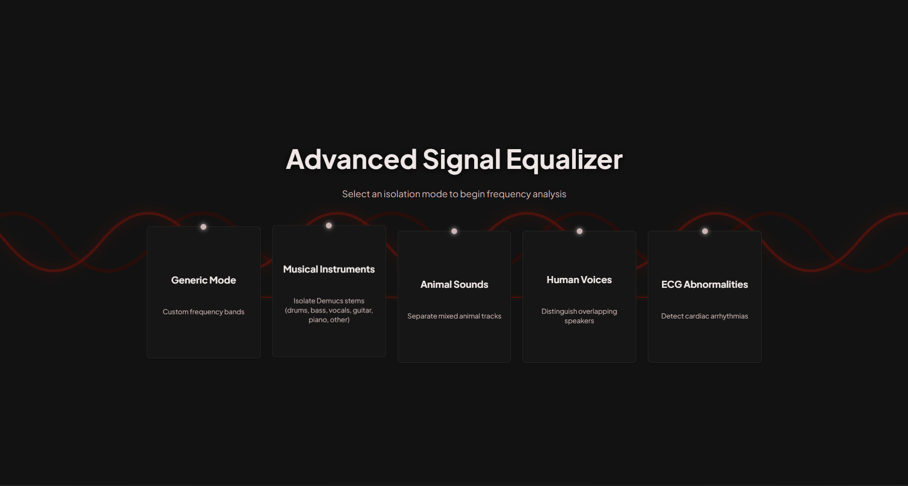

*Pick a mode. Load a signal. See everything — instantly.*

---

## What is this?

Signal Equalizer is a full-stack signal processing workbench. You load an audio file (or generate a synthetic one), choose a processing mode, and the app gives you:

- Side-by-side **input vs output waveform** viewers
- **FFT spectrum** comparison in real time
- **Wavelet decomposition** with selectable basis functions
- **Spectrogram** heatmaps for time-frequency analysis
- **AI-powered separation** for music, voices, and ECG diagnostics

Every slider interaction immediately re-processes the signal through the backend and updates all charts live.

---

## Five Modes


### ⟟ Generic Mode
> *Build your own equalizer — no fixed bands, no limitations.*

Generic mode is a blank canvas. You define the frequency bands yourself: set the low and high cutoff in Hz, name the band, and control its gain. This makes it suitable for equalizing any kind of audio signal — speech recordings, environmental audio, synthesized tones, whatever you need.

**How to use it:**
1. Click **Add band** to create a new frequency range
2. Enter the **Low Hz** and **High Hz** boundaries
3. Drag the **Gain slider** (0× = silence, 1× = unchanged, 2× = boost)
4. Drag the band label to reorder bands in the list
5. The equalizer curve at the top of the left panel updates instantly

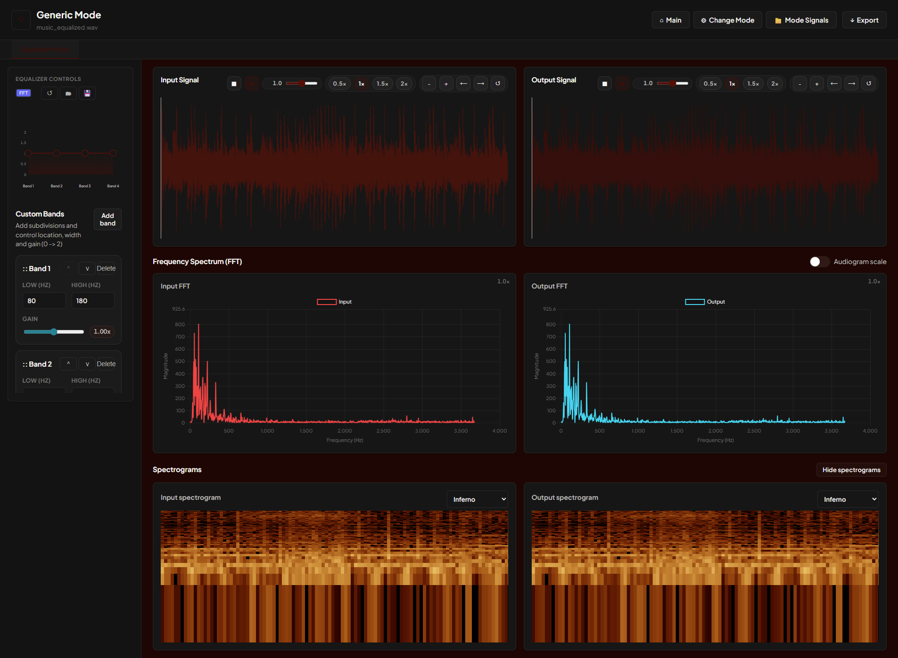

*The left panel shows the custom band builder with 4 default bands. The center and right panels show the input/output waveforms and live FFT spectrum.*

**Video Demo:**  


---

### ♫ Musical Instruments
> *Boost a guitar, cut the bass, isolate vocals — one slider each.*

Musical Instruments mode maps 6 sliders to the natural frequency footprint of each instrument family in a mix. It's designed for audio that contains multiple layered sources (a full band recording, a produced track, a synthesized mix). Processing can run through either the **FFT** path or the **Wavelet** path — select in the Equalizer Controls panel.

| Band | Frequency Range | What it targets |
|------|----------------|----------------|
| Drums | 20 – 12,000 Hz | Kick, snare, hi-hat, percussion |
| Bass | 20 – 300 Hz | Bass guitar, sub-bass |
| Vocals | 80 – 8,000 Hz | Lead and backing vocals |
| Guitar | 80 – 5,000 Hz | Electric and acoustic guitar |
| Piano | 27 – 5,000 Hz | Piano and keyboards |
| Other | 20 – 20,000 Hz | Everything else in the mix |

**AI Separation:** Switch to the **AI Separation** tab to run Demucs — an AI model that separates the audio into 6 individual stems. Download each stem as a WAV file and compare against the DSP band-filtered result.

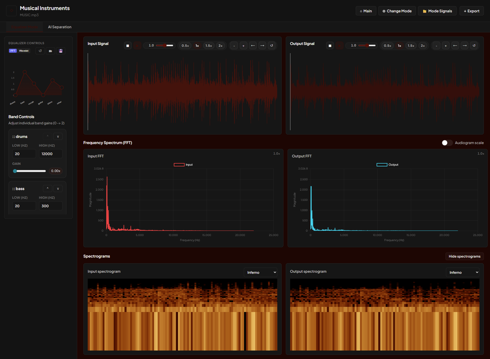

*The equalizer curve shows 6 bands across the full spectrum. Default wavelet basis is `db8`, optimized for harmonic instruments.*

**Video Demo:**  


---

### ❖ Animal Sounds
> *Isolate or suppress specific animal vocalizations by frequency.*

Animal Sounds mode uses scientifically-determined vocalization ranges for 5 animal families. Each slider targets the natural call frequency of that group, so you can boost one animal type while attenuating others — useful for wildlife audio analysis, bioacoustic research, or just exploring how animal sounds overlap.

| Band | Frequency Range | Examples |
|------|----------------|----------|
| Songbirds | 1,000 – 8,000 Hz | Sparrow, canary, warbler, finch |
| Canines | 150 – 2,000 Hz | Dog, wolf, hyena, fox |
| Felines | 48 – 10,000 Hz | Cat, lion, tiger, leopard |
| Large Mammals | 5 – 500 Hz | Elephant, whale, horse, cattle |
| Insects | 600 – 20,000 Hz | Cricket, cicada, bee, grasshopper |

**Processing:** Supports both FFT and Wavelet paths. Default wavelet basis is `sym8`, well-suited to bioacoustic textures. Adjust wavelet level gains in the Wavelet tab for finer multi-scale control.

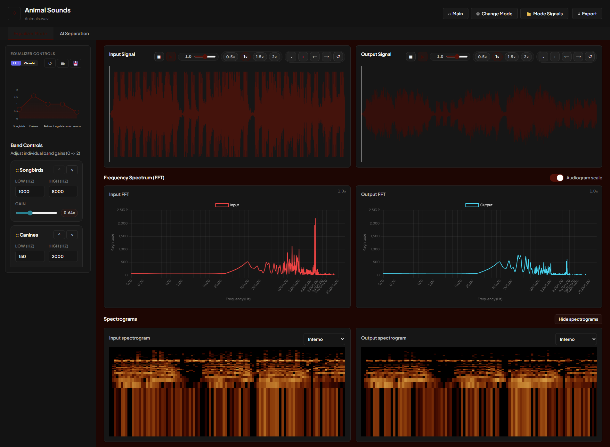

*The FFT chart clearly shows the synthetic signal's frequency content. Bands overlap intentionally because real animal vocalizations share frequency space — the gain sliders let you tilt the balance toward any group.*

**Video Demo:**  


---

### ⌁ Human Voices
> *Separate overlapping speakers by their fundamental speaking frequency.*

Human Voices mode targets the fundamental frequency range of four voice categories. It's useful when you have a recording with multiple overlapping speakers and want to attenuate or isolate one group — for example, reduce child voices while keeping adult speech, or compare male vs. female frequency content.

| Band | Frequency Range | Typical speaker |
|------|----------------|----------------|
| Male | 85 – 180 Hz | Adult male voices |
| Female | 165 – 300 Hz | Adult female voices |
| Old | 80 – 150 Hz | Elderly voices (slightly lower register) |
| Child | 220 – 420 Hz | Children's voices (higher fundamental) |

**AI Separation:** The **AI Separation** tab runs SpeechBrain's SepFormer model — a deep learning model trained for 2-speaker separation. Outputs 2 separated speaker streams as downloadable WAV files. Default wavelet basis is `sym5`, optimized for speech formants.

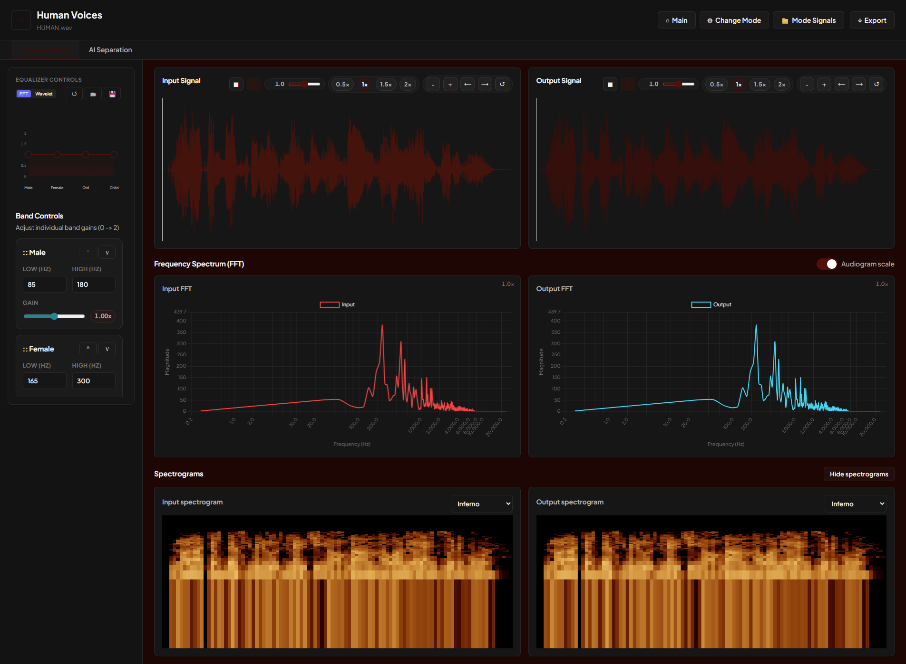

*Male and Female bands overlap in the mid-range — this is intentional, as pitch ranges overlap in real speech. Adjust gains to tilt the balance toward one group.*

**Video Demo:**  


---

### ♡ ECG Abnormalities
> *Process cardiac signals and isolate arrhythmia components by frequency.*

ECG mode is the only non-audio mode. It operates at **500 Hz sampling rate** (cardiac signals, not audio) and targets the characteristic frequency signatures of four cardiac rhythm types. Each band isolates a component of the heart's electrical activity, letting you boost or suppress specific arrhythmia signatures.

| Band | Frequency Range | What it isolates |
|------|----------------|-----------------|
| Normal | 2.2 – 15.5 Hz | Normal sinus rhythm |
| AFib | 0 – 179.4 Hz | Atrial fibrillation signature |
| VTach | 2.2 – 3.3 Hz | Ventricular tachycardia |
| HeartBlock | 2.2 – 31.0 Hz | Heart block / conduction delay |

**AI Diagnosis:** The **AI Separation** tab runs a ResNet-based arrhythmia classifier. It returns per-class probability scores (Normal / AFib / VTach / HeartBlock) along with a **GradCAM explainability heatmap** showing which parts of the signal drove the model's decision. Default wavelet basis is `bior3.5`, which is well-suited for ECG waveform morphology.

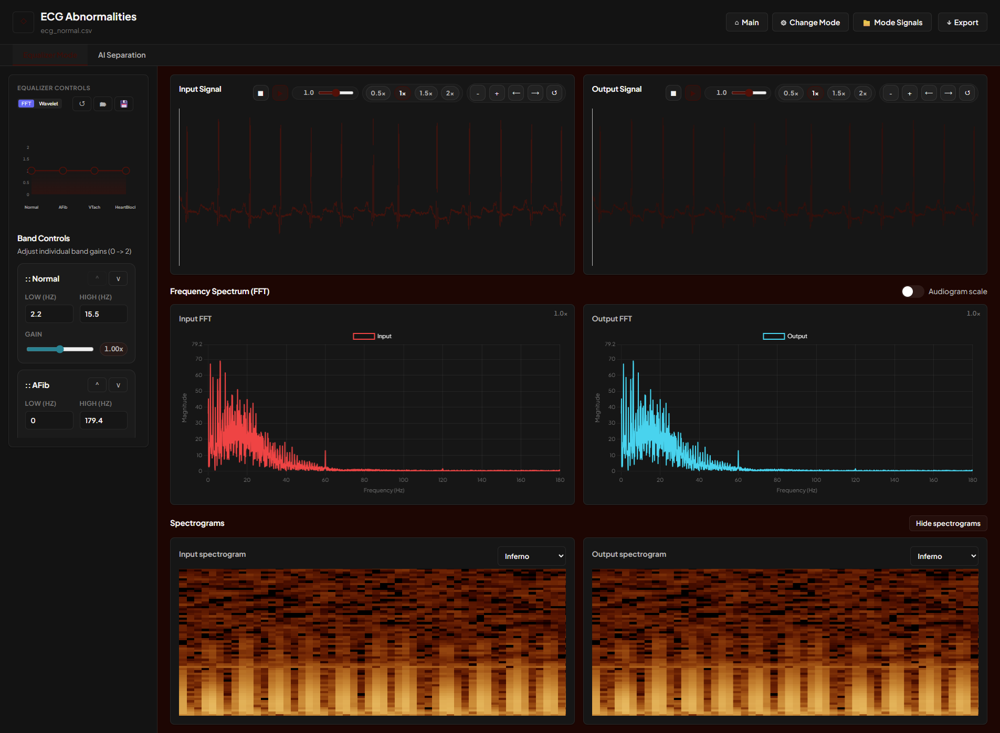

*The characteristic irregular ECG signal is visible in the waveform viewers. The FFT shows energy concentrated at low frequencies (0–250 Hz), reflecting cardiac signal characteristics.*

**Video Demo:**  


---

## Signal Analysis Features

### 📊 FFT Spectrum (Input vs Output)

Every mode shows the frequency spectrum of both the input and processed output — live, side by side. You can immediately see how your equalization affects the signal in the frequency domain. Toggle **Audiogram scale** to switch between linear and logarithmic display.

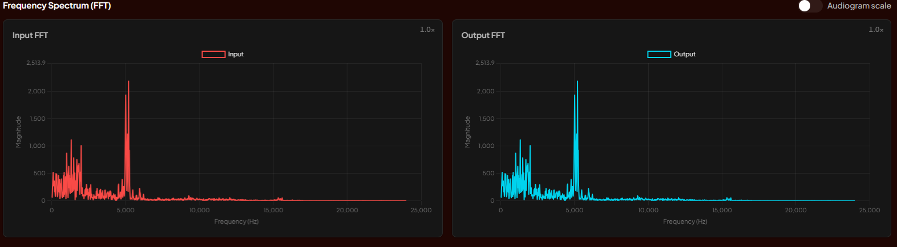
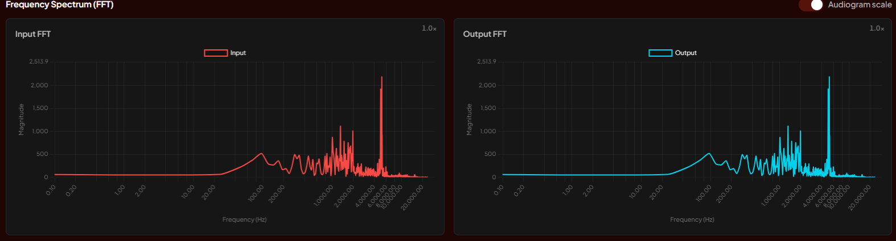

---

### 🎨 Spectrogram (Time-Frequency Heatmap)

Click **Show spectrograms** to reveal STFT-based time-frequency heatmaps for both input and output. Multiple color scales are available — **Inferno**, **Viridis**, **Plasma**, and more. Spectrograms make it easy to spot bursts, sustained tones, and temporal changes in the signal.

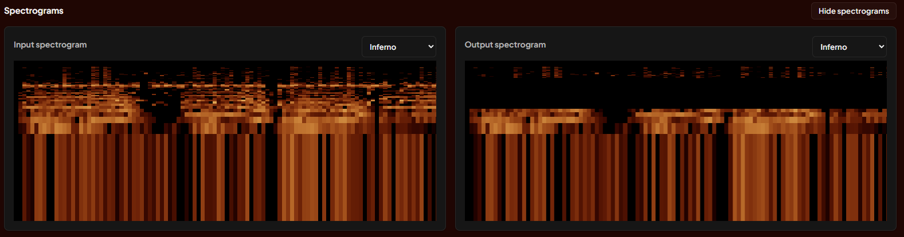

---

### 🌊 Wavelet Processing

Switch from FFT to **Wavelet mode** using the toggle in the Equalizer Controls panel. This changes the processing pipeline from frequency-domain to multi-scale wavelet decomposition.

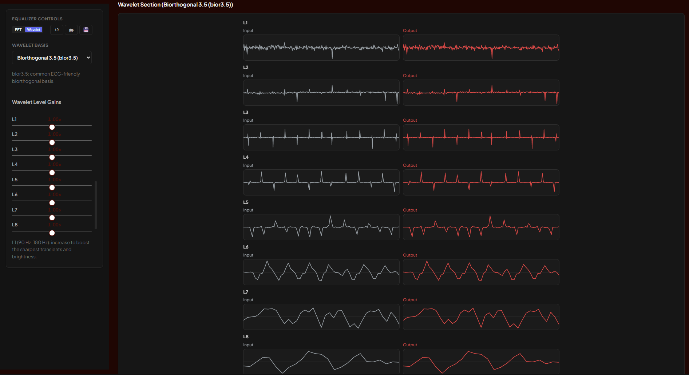

In wavelet mode you get:

- **Per-level gain sliders** (L1–Ln) — each level corresponds to a different frequency scale
- **Wavelet basis selector** — 9 options, each with a different time-frequency trade-off:

| Basis | Code | Best suited for |
|-------|------|----------------|
| Haar | `haar` | Sharp transients, quick decomposition |
| Daubechies 4 | `db4` | General purpose (Generic mode default) |
| Daubechies 6 | `db6` | Smoother than db4, more overlap |
| Daubechies 8 | `db8` | Harmonic-rich audio (Music default) |
| Symlet 5 | `sym5` | Near-symmetric, speech (Human default) |
| Symlet 8 | `sym8` | Bioacoustic textures (Animal default) |
| Coiflet 3 | `coif3` | Symmetric, good reconstruction |
| Biorthogonal 3.5 | `bior3.5` | ECG-friendly (ECG default) |
| Discrete Meyer | `dmey` | Smooth frequency localization |

The maximum decomposition level is automatically calculated from the signal length and wavelet filter size.

---

### 🤖 AI Separation

Every applicable mode has an **AI Separation** tab alongside the main Equalizer view.

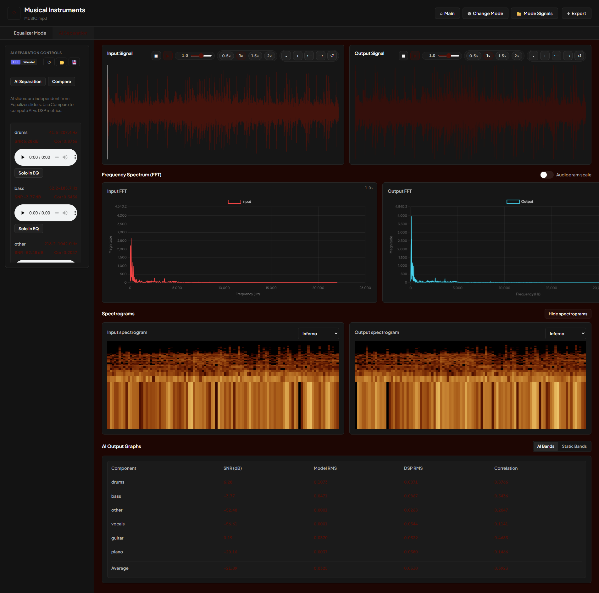

| Mode | AI Model | Output |
|------|----------|--------|
| **Music** | Demucs (htdemucs_6s) | 6 downloadable WAV stems |
| **Human Voices** | SpeechBrain SepFormer | 2 speaker stems |
| **ECG** | ResNet + GradCAM | Arrhythmia probabilities + explainability heatmap |

Downloadable stems allow you to compare AI-separated sources directly against the DSP band-filtered results.

---

### 🔊 Mode Selector

Switch between all five modes at any time without losing work — each mode has completely isolated state.

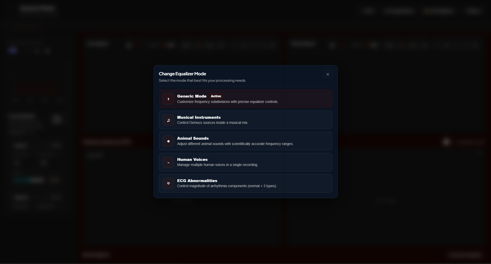

---

## Other Features

**Audio Transport Controls** — Each signal viewer has independent playback with play, pause, stop, rate (0.5× · 1× · 1.5× · 2×), and volume.

**Signal Management** — Upload your own WAV files or use built-in synthetic sample generators (one per mode). Uploaded signals are stored per mode and can be listed, reloaded, or deleted.

**Save & Load Settings** — Export your equalizer configuration as JSON (bands, gains, wavelet basis, wavelet level). Load it back later. Preset schemas for the frontend layout can be saved and restored separately.

**Export** — Download the processed output signal as a WAV file.

---

## 🔌 API Reference

All endpoints at `http://localhost:8000` | Interactive docs at [`/docs`](http://localhost:8000/docs)

<details>
<summary><b>Core endpoints</b></summary>

| Method | Path | Purpose |
|--------|------|---------|
| `GET` | `/` | API root |
| `GET` | `/health` | Health check |
| `POST` | `/upload` | Upload audio + optional settings JSON |
| `POST` | `/save-settings` | Persist equalizer settings |
| `POST` | `/load-settings` | Load saved settings |
| `POST` | `/save_schema` | Save frontend layout preset |
| `POST` | `/load_schema` | Load frontend layout preset |
| `GET` | `/sample/{mode}` | Get synthetic sample for any mode |

</details>

<details>
<summary><b>Generic mode</b></summary>

```
POST   /api/modes/generic/process
GET    /api/modes/generic/settings/default
POST   /api/modes/generic/validate-bands
POST   /api/modes/generic/upload-signal
GET    /api/modes/generic/signals
POST   /api/modes/generic/signal/{filename}/load
DELETE /api/modes/generic/signal/{filename}
```
</details>

<details>
<summary><b>Music mode</b></summary>

```
POST   /api/modes/music/process
GET    /api/modes/music/settings/default
GET    /api/modes/music/instruments
POST   /api/modes/music/separate-ai
GET    /api/modes/music/ai-stems/{job_id}/{stem_filename}
POST   /api/modes/music/upload-signal
GET    /api/modes/music/signals
POST   /api/modes/music/signal/{filename}/load
DELETE /api/modes/music/signal/{filename}
```
</details>

<details>
<summary><b>Animals mode</b></summary>

```
POST   /api/modes/animals/process
GET    /api/modes/animals/settings/default
GET    /api/modes/animals/animals
POST   /api/modes/animals/upload-signal
GET    /api/modes/animals/signals
POST   /api/modes/animals/signal/{filename}/load
DELETE /api/modes/animals/signal/{filename}
```
</details>

<details>
<summary><b>Humans mode</b></summary>

```
POST   /api/modes/humans/process
GET    /api/modes/humans/settings/default
GET    /api/modes/humans/voice-types
POST   /api/modes/humans/separate-ai
GET    /api/modes/humans/ai-stems/{job_id}/{stem_filename}
POST   /api/modes/humans/upload-signal
GET    /api/modes/humans/signals
POST   /api/modes/humans/signal/{filename}/load
DELETE /api/modes/humans/signal/{filename}
```
</details>

<details>
<summary><b>ECG mode</b></summary>

```
POST   /api/modes/ecg/process
GET    /api/modes/ecg/settings/default
GET    /api/modes/ecg/components
POST   /api/modes/ecg/upload-signal
GET    /api/modes/ecg/signals
POST   /api/modes/ecg/signal/{filename}/load
DELETE /api/modes/ecg/signal/{filename}
POST   /api/modes/ecg/ai-analyze
POST   /api/modes/ecg/ai-analyze-file
```
</details>

---

## 🛠️ Tech Stack

| Layer | Technologies |
|-------|-------------|
| **Backend** | FastAPI · NumPy · SciPy · PyWavelets · SoundFile · Pandas · Torch · Torchaudio |
| **AI Models** | Demucs · SpeechBrain SepFormer · ResNet (ECG) |
| **Frontend** | React 18 · Vite · Axios · Chart.js · react-chartjs-2 |

---

## 🚀 Quick Start

```bash
# Start backend
cd backend
pip install -r requirements.txt
uvicorn main:app --reload --host 0.0.0.0 --port 8000

# Start frontend (new terminal)
cd frontend
npm install
npm run dev
```

Open **http://localhost:5173** — the backend needs to be running for signal processing to work.

> **Windows note:** If `npm run dev` is blocked by execution policy, use `npm.cmd run dev` instead.

---

## 📁 Project Structure

```text
Signal-Equalizer/
├─ backend/
│  ├─ main.py               # FastAPI app entry + synthetic signal generators
│  ├─ core/                  # Shared FFT/wavelet processing utilities
│  ├─ modes/
│  │  ├─ generic/            # Custom band equalization
│  │  ├─ music/              # Demucs stem separation + DSP
│  │  ├─ animals/            # Animal vocalization processing
│  │  ├─ humans/             # SepFormer voice separation + DSP
│  │  └─ ecg/                # Cardiac analysis + ResNet AI
│  ├─ models/                # AI model wrappers
│  ├─ settings/              # Default configs + user-saved presets
│  └─ uploads/               # Per-mode uploaded signal storage
├─ frontend/
│  ├─ src/
│  │  ├─ App.jsx             # Main application (modes, state, layout)
│  │  ├─ api.js              # Backend API client (all endpoints)
│  │  ├─ components/         # WaveformViewer, FFTChart, SpectrogramViewer, ...
│  │  ├─ hooks/              # useBackendProcessing (debounce + cancellation)
│  │  ├─ services/           # Service layer
│  │  ├─ modes/              # Per-mode band configurations
│  │  └─ mock/               # Offline development data
│  └─ package.json
└─ screenshots/              # README media assets
```

---

## 📝 License

This project is part of a signal processing coursework implementation.
